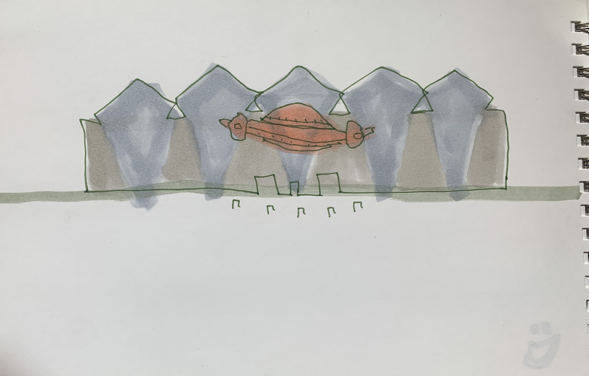

# Writing Meditation 2 - CONCEPT DIAGRAM
### DUE MONDAY 4/12
        This is a two-pat exercise. Finish part one BEFORE reading part 2.
        
        Part I
        Draw a diagram of your idea. 
	Place the main theme of your project at the center. 
	Visually arrange other keywords/themes around it. 
	Don’t hold back, include any idea, theme, question 
	that factors into your project, place ones you’re unsure of at the margins. 
	If you feel like there isn't a single main theme, 
	draw a cluster of the main ideas and build from there.

ugh idk if it should be a website or a MV or a physical installation :(

         Part II 